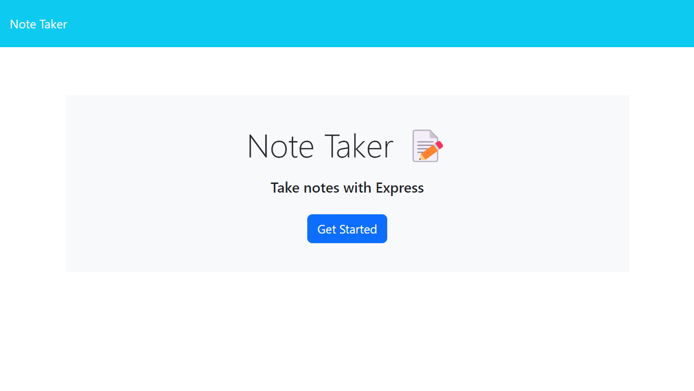
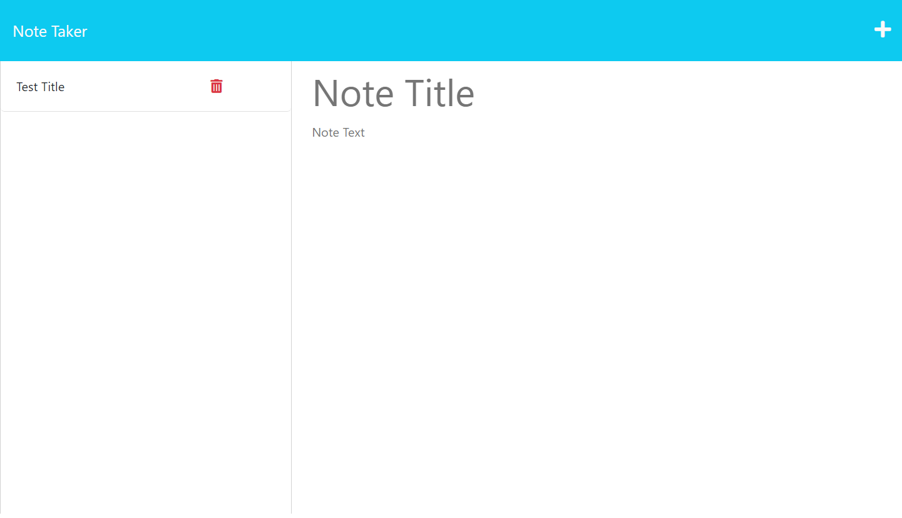
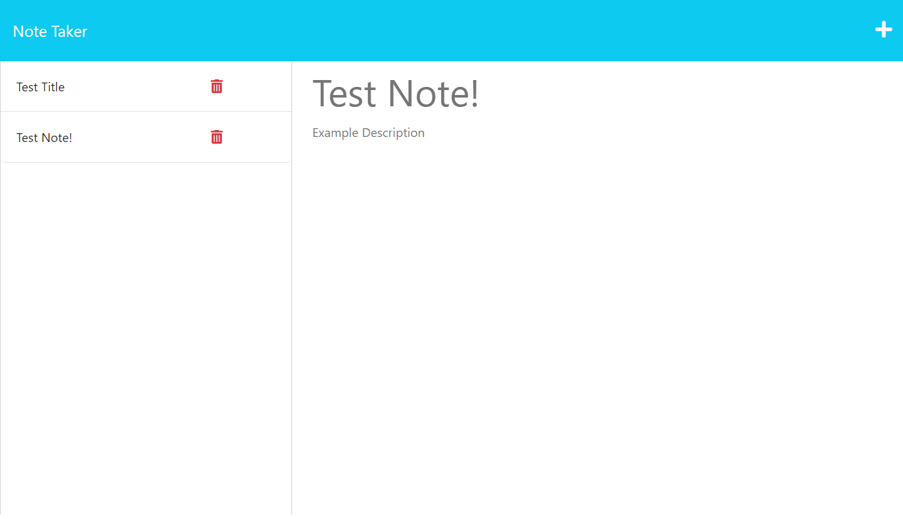

# Note Taker

## Description
This is a Note Taker application that can be used to write and save notes. The application uses an Express.js back end and will save and retrieve note data from a JSON file. 

## Links
[Heroku deployment link](https://laub-expressnotes-e5ef651a4f77.herokuapp.com/)

[GitHub Repository Link](https://github.com/sydlaub/Express-Note-Taker)

## Screenshots
Application home page

Notes page without any saved notes

Tester note saved

## Installation Instrutions
To run a copy of this app on your local machine, first clone the repository:

SSH: 
git@github.com:sydlaub/Express-Note-Taker.git

Then cd into the cloned directory and download the necessary dependencies by typing the following command into the CL:

npm install

Next, start the application by typing the following into the command line:

node server.js

Then go to your browser and enter the following into the address bar:

http://localhost:3001

## Technologies
Built with Node.js

Built with Express.js

## Credits
Collaborators include teachers, TAs, tutors and fellow students in the Columbia University Full Stack Engineering Bootcamp 2023 Spring cohort.
NOTE: This application starter code was provided by the Columbia University School of Engineering. 
